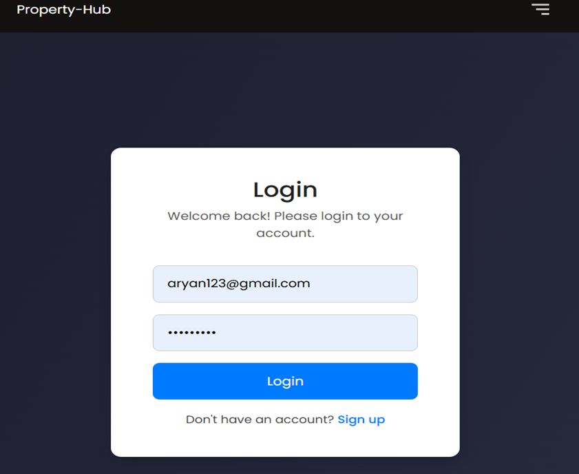
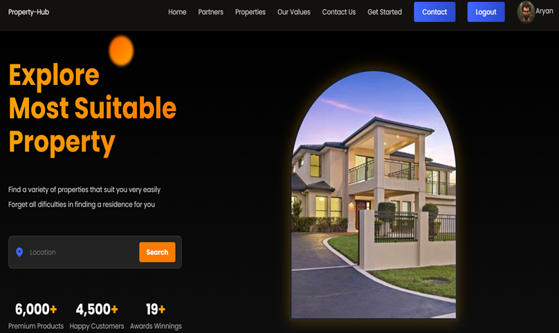
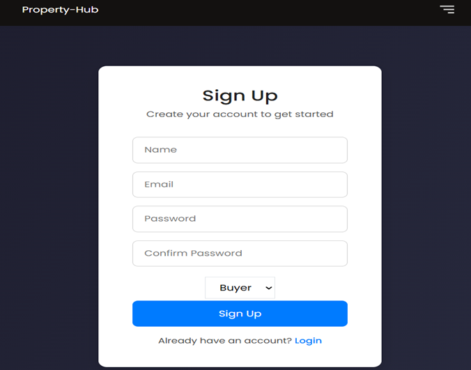
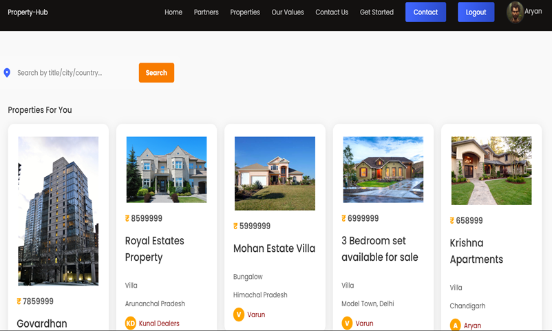
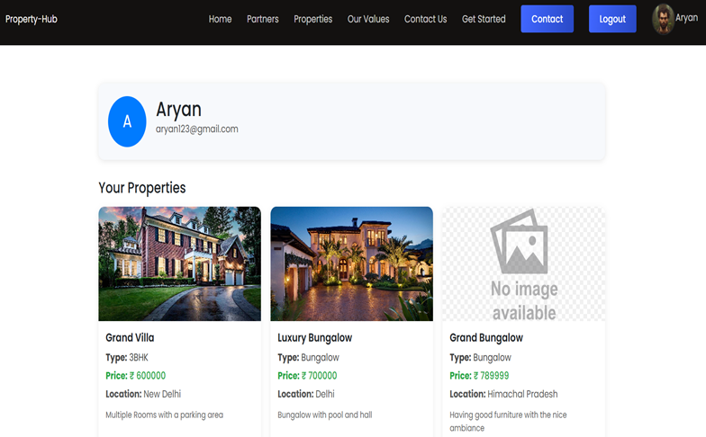

# 🏠 Property-Hub

**Property-Hub** is a modern, user-friendly real estate listing platform designed for buyers and sellers to explore and manage properties efficiently. Built with the MERN stack and featuring personalized recommendations, the platform allows users to sign up, log in, list properties, and search for suitable properties easily.

---

## 📸 Demo Screenshots

### 🔐 Login Page


### 🏡 Homepage


### 📝 Sign Up Page


### 🧭 Property Listings


### 👤 User Profile with Owned Properties


### ⭐ Recommended Properties


---

## 🚀 Features

- 🔐 Secure authentication (Login & Sign-up)
- 🏡 Property browsing by location, title, city, or country
- 📝 Seller-specific property listing functionality
- 🤝 Buyer-specific property exploration and booking
- ⭐ Personalized property recommendations
- 🧭 Clean, modern UI with intuitive navigation
- 🖼️ Dynamic image handling and profile display

---

## 🛠️ Tech Stack

- **Frontend:** React, Tailwind CSS
- **Backend:** Node.js, Express.js
- **Database:** MongoDB
- **Authentication:** JWT
- **Other Libraries:** React Router, React Hook Form, Zod, Swiper.js

---

## 📁 Folder Structure
Property-Hub/
├── client/ # Frontend
│ └── src/
│ ├── components/
│ ├── pages/
│ └── assets/screenshots/
├── server/ # Backend
│ └── routes/
│ └── controllers/
│ └── models/
├── .env
├── README.md
└── package.json


---

## 🧪 How to Run the Project Locally

### Clone the repository:

```bash
git clone https://github.com/your-username/property-hub.git
cd property-hub

Install dependencies for both frontend and backend:
cd client
npm install
cd ../server
npm install

Create .env file in the server root:
PORT=5000
MONGO_URI=your_mongodb_connection_string
JWT_SECRET=your_secret

# In client/
npm start

Run the development server:
# In server/
npm run dev

